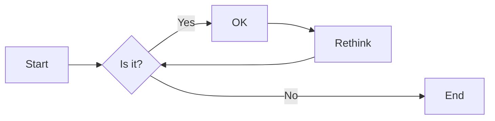
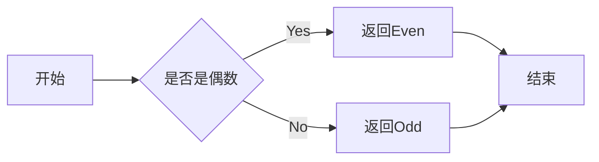

# 实验二 Python变量、简单数据类型

班级： 21计科3班

学号： B20210302312

姓名： 曾靖

Github地址：<https://github.com/flojelr/python-class>

CodeWars地址：<https://www.codewars.com/users/flojelr>

---

## 实验目的

1. 使用VSCode编写和运行Python程序
2. 学习Python变量和简单数据类型

## 实验环境

1. Git
2. Python 3.10
3. VSCode
4. VSCode插件

## 实验内容和步骤

### 第一部分

实验环境的安装

1. 安装Python，从Python官网下载Python 3.10安装包，下载后直接点击可以安装：[Python官网地址](https://www.python.org/downloads/)
2. 为了在VSCode集成环境下编写和运行Python程序，安装下列VScode插件
   - Python
   - Python Environment Manager
   - Python Indent
   - Python Extended
   - Python Docstring Generator
   - Jupyter
   - indent-rainbow
   - Jinja

---

### 第二部分

Python变量、简单数据类型和列表简介

完成教材《Python编程从入门到实践》下列章节的练习：

- 第2章 变量和简单数据类型

---

### 第三部分

在[Codewars网站](https://www.codewars.com)注册账号，完成下列Kata挑战：

---

#### 第1题：求离整数n最近的平方数（Find Nearest square number）

难度：8kyu

你的任务是找到一个正整数n的最近的平方数
例如，如果n=111，那么nearest_sq(n)（nearestSq(n)）等于121，因为111比100（10的平方）更接近121（11的平方）。
如果n已经是完全平方（例如n=144，n=81，等等），你需要直接返回n。
代码提交地址
<https://www.codewars.com/kata/5a805d8cafa10f8b930005ba>

---

#### 第2题：弹跳的球（Bouncing Balls）

难度：6kyu

一个孩子在一栋高楼的第N层玩球。这层楼离地面的高度h是已知的。他把球从窗口扔出去。球弹了起来,  例如:弹到其高度的三分之二（弹力为0.66）。他的母亲从离地面w米的窗户向外看,母亲会看到球在她的窗前经过多少次（包括球下落和反弹的时候）？

一个有效的实验必须满足三个条件：

- 参数 "h"（米）必须大于0
- 参数 "bounce "必须大于0且小于1
- 参数 “window "必须小于h。

如果以上三个条件都满足，返回一个正整数，否则返回-1。
**注意:只有当反弹球的高度严格大于窗口参数时，才能看到球。**
代码提交地址
<https://www.codewars.com/kata/5544c7a5cb454edb3c000047/train/python>

---

#### 第3题： 元音统计(Vowel Count)

难度： 7kyu

返回给定字符串中元音的数量（计数）。对于这个Kata，我们将考虑a、e、i、o、u作为元音（但不包括y）。输入的字符串将只由小写字母和/或空格组成。

代码提交地址：
<https://www.codewars.com/kata/54ff3102c1bad923760001f3>

---

#### 第4题：偶数或者奇数（Even or Odd）

难度：8kyu

创建一个函数接收一个整数作为参数，当整数为偶数时返回”Even”当整数位奇数时返回”Odd”。
代码提交地址：
<https://www.codewars.com/kata/53da3dbb4a5168369a0000fe>

### 第四部分

使用Mermaid绘制程序流程图

安装Mermaid的VSCode插件：

- Markdown Preview Mermaid Support
- Mermaid Markdown Syntax Highlighting

使用Markdown语法绘制你的程序绘制程序流程图（至少一个），Markdown代码如下：


显示效果如下：



查看Mermaid流程图语法-->[点击这里](https://mermaid.js.org/syntax/flowchart.html)

使用Markdown编辑器（例如VScode）编写本次实验的实验报告，包括[实验过程与结果](#实验过程与结果)、[实验考查](#实验考查)和[实验总结](#实验总结)，并将其导出为 **PDF格式** 来提交。

## 实验过程与结果

### 第二章练习题

练习2.1： 简单信息  将一条消息赋给变量，并将其打印出来。

运行代码如下：

```python
mes = "message"
print(mes)
```

运行结果

message

练习2.2： 多条简单信息 将一条消息赋给变量，并将其打印出来；再将变量的值修改为一条新消息，并将其打印出来。

运行代码如下：

```python
mes = "message"
print(mes)
mes="hello world!"
print(mes)
```

运行结果

message

hello world!

练习2.3： 个性化消息 用变量表示一个人的名字，并向其显示一条消息。

运行代码如下：

```python
name="Eric"
print("Hello"+name+",would you like to learn some Python today?")
```

运行结果

HelloEric,would you like to learn some Python today?

练习2.4： 调整名字大小写 用变量表示一个人的名字，再分别以全小写、全大写和首字母大写的方式显示这个人名。

运行代码如下：

```python
name="Eric"
print(name.lower())
print(name.upper())
print(name.title())
```

运行结果

eric

ERIC

Eric

练习2.5： 名言1 找到你钦佩的名人说的一句名言，将这个名人的姓名和名言打印出来。

运行代码如下：

```python
print('Albert Einstein once said,"A people who never made a mistake never tried anything new."')
```

运行结果

Albert Einstein once said,"A people who never made a mistake never tried anything new."

练习2.6： 名言2 重复练习2.5，但是用变量famous_person表示人名，再创建要显示的消息并将其赋值给变量message，然后打印这条消息。

运行代码如下：

```python
famous_person="Albert Einstein"
message='once said,"A people who never made a mistake never tried anything new."'
print(famous_person+message)
```

运行结果

Albert Einsteinonce said,"A people who never made a mistake never tried anything new."

练习2.7： 删除人名中的空白 用变量表示一个人的名字，并在其开头和末尾都包含一些空白字符。务必至少使用字符组合“\t”和“\n”各一次。

打印这个人名，显示其开头和末尾的空白。然后，分别使用函数lstrip()、rstrip()、和strip()对人名进行处理，并将结果打印出来。

运行代码如下：

```python
name=" \tmal\nkke  "
print("name="+name)
print("name.lstrip="+name.lstrip())
print("name.rstrip="+name.rstrip())
print("name.strip="+name.strip())
```

运行结果

name= 	mal
kke  
name.lstrip=mal
kke  
name.rstrip= 	mal
kke
name.strip=mal
kke

练习2.8： 文件扩展名 Python提供了removesuffix()方法，其工作原理与removeprefix()很像。请将值‘python_notes.txt’赋值给变量fliename，再使用reemovesuffix()方法来显示不包括扩展名的文件名，就像文件浏览器所做的那样。

运行代码如下：

```python
fliename="python_notes.txt"
print(fliename.removesuffix(".txt"))
```

运行结果

python_notes

练习2.9： 数字8  编写4个表达式，分别使用加法、减法、乘法和除法运算，但是结果都是8.为了使用函数调用print()来显示代码，务必将这些表达式用括号括起来。也就是说，你应该编写4行类似于"print(5+3)"的代码,输出应为4行，其中每行都只包含数字8.

运行代码如下：

```python
print(1+7)
print(2*4)
print(10-2)
print(16/2)
```

运行结果

8

8

8

8.0

练习2.10： 最喜欢的数 用一个变量来表示你最喜欢的数，再使用这个变量创建一条消息，指出你最喜欢的数是什么，然后将这条消息打印出来。

运行代码如下：

```python
count=100
print("我最喜欢的数是："+str(count))
```

运行结果

我最喜欢的数是：100

### Codewars Kata挑战

1. 第一题 求离整数n最近的平方数（Find Nearest square number）

    你的任务是找到一个正整数n的最近的平方数
    例如，如果n=111，那么nearest_sq(n)（nearestSq(n)）等于121，因为111比100（10的平方）更接近121（11的平方）。
    如果n已经是完全平方（例如n=144，n=81，等等），你需要直接返回n。

    代码如下

    ```python
        from math import sqrt

    def nearest_sq(n):
        # pass
        x=sqrt(n)
        x=round(x,0)
        return x*x
    ```

2. 第二题 弹跳的球（Bouncing Balls）

    一个孩子在一栋高楼的第N层玩球。这层楼离地面的高度h是已知的。他把球从窗口扔出去。球弹了起来,  例如:弹到其高度的三分之二（弹力为0.66）。他的母亲从离地面w米的窗户向外看,母亲会看到球在她的窗前经过多少次（包括球下落和反弹的时候）？

    一个有效的实验必须满足三个条件：

    - 参数 "h"（米）必须大于0
    - 参数 "bounce "必须大于0且小于1
    - 参数 “window "必须小于h。

    如果以上三个条件都满足，返回一个正整数，否则返回-1。
    **注意:只有当反弹球的高度严格大于窗口参数时，才能看到球。**

    代码如下

    ```python
    def bouncing_ball(h, bounce, window):
    # your code
    count=-1
    if h>0 and bounce<1 and bounce>0 and window<h :
        count+=2
        fh=h*bounce
        while fh>window :
            count+=2
            fh*=bounce
    return count
    ```

3. 第三题 元音统计(Vowel Count)

    返回给定字符串中元音的数量（计数）。对于这个Kata，我们将考虑a、e、i、o、u作为元音（但不包括y）。输入的字符串将只由小写字母和/或空格组成。

    代码如下

    ```python
    def get_count(sentence):
    count =0
    length = len(sentence)
    for i in range(0,length):
        if 'a' == sentence[i] or 'e' == sentence[i]or 'i' == sentence[i]or 'o' == sentence[i]or 'u' == sentence[i]:
            count+=1
    #print(count)
    #pass
    return count
    ```

4. 第四题 偶数或者奇数（Even or Odd）

    创建一个函数接收一个整数作为参数，当整数为偶数时返回”Even”当整数位奇数时返回”Odd”。

    代码如下

    ```python
    def even_or_odd(number):
        if number%2==0:
            return "Even"
        else: return "Odd"
    ```

### 流程图

第4题的流程图如下



## 实验考查

请使用自己的语言并使用尽量简短代码示例回答下面的问题，这些问题将在实验检查时用于提问和答辩以及实际的操作。

1. Python中的简单数据类型有那些？我们可以对这些数据类型做哪些操作？

    答：Python中的简单数据类型包括整数(int), 浮点数(float), 布尔值(bool), 字符串(str)和空值(NoneType)。我们可以对这些数据类型进行基本的数学运算、逻辑运算、字符串操作等。

2. 为什么说Python中的变量都是标签？

   答：Python 里的变量，与其说是装数据的容器，倒不如说是贴在数据上的标签。 变量并不占用空间，占用空间的是数据本身。 当你重新赋值时，就相当于撕下这个标签，贴纸另一个数据上。

3. 有哪些方法可以提高Python代码的可读性？

    答：1、格式化代码 2、使用有意义的变量名 3、合理使用注释　4、封装代码块　5、合理利用空白行　6、使用合适的缩进。

## 实验总结

在对python进行学习的过程中，我们需要了解python中已有的方法，这对我们编写代码有很大的帮助。