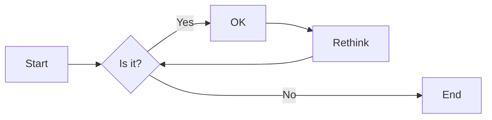
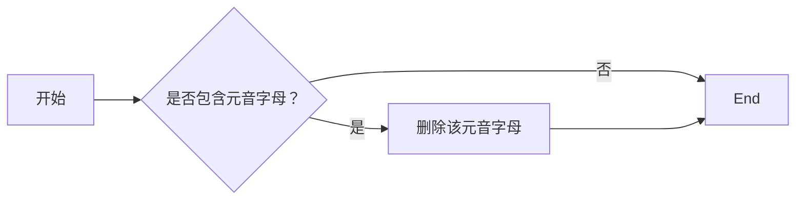

# 实验三 Python列表

班级： 21计科3班

学号： B20210302312

姓名： 曾靖

Github地址：<https://github.com/flojelr/python-class>

CodeWars地址：<https://www.codewars.com/users/flojelr>

---

## 实验目的

1. 学习Python的简单使用和列表操作
2. 学习Python中的if语句

## 实验环境

1. Git
2. Python 3.10
3. VSCode
4. VSCode插件

## 实验内容和步骤

### 第一部分

Python列表操作

完成教材《Python编程从入门到实践》下列章节的练习：

- 第3章 列表简介
- 第4章 操作列表
- 第5章 if语句

---

### 第二部分

在[Codewars网站](https://www.codewars.com)注册账号，完成下列Kata挑战：

---

#### 第一题：3和5的倍数（Multiples of 3 or 5）

难度： 6kyu

如果我们列出所有低于 10 的 3 或 5 倍数的自然数，我们得到 3、5、6 和 9。这些数的总和为 23. 完成一个函数，使其返回小于某个整数的所有是3 或 5 的倍数的数的总和。此外，如果数字为负数，则返回 0。

注意：如果一个数同时是3和5的倍数，应该只被算一次。

**提示：首先使用列表解析得到一个列表，元素全部是3或者5的倍数。
使用sum函数可以获取这个列表所有元素的和.**

代码提交地址：
<https://www.codewars.com/kata/514b92a657cdc65150000006>

---

#### 第二题： 重复字符的编码器（Duplicate Encoder）

难度： 6kyu

本练习的目的是将一个字符串转换为一个新的字符串，如果新字符串中的每个字符在原字符串中只出现一次，则为"("，如果该字符在原字符串中出现多次，则为")"。在判断一个字符是否是重复的时候，请忽略大写字母。

例如:

```python
"din"      =>  "((("
"recede"   =>  "()()()"
"Success"  =>  ")())())"
"(( @"     =>  "))(("
```

代码提交地址:
<https://www.codewars.com/kata/54b42f9314d9229fd6000d9c>

---

#### 第三题：括号匹配（Valid Braces）

难度：6kyu

写一个函数，接收一串括号，并确定括号的顺序是否有效。如果字符串是有效的，它应该返回True，如果是无效的，它应该返回False。
例如：

```python
"(){}[]" => True 
"([{}])" => True
 "(}" => False
 "[(])" => False 
"[({})](]" => False
```

**提示：
python中没有内置堆栈数据结构，可以直接使用`list`来作为堆栈，其中`append`方法用于入栈，`pop`方法可以出栈。**

代码提交地址
<https://www.codewars.com/kata/5277c8a221e209d3f6000b56>

---

#### 第四题： 从随机三元组中恢复秘密字符串(Recover a secret string from random triplets)

难度： 4kyu

有一个不为你所知的秘密字符串。给出一个随机三个字母的组合的集合，恢复原来的字符串。

这里的三个字母的组合被定义为三个字母的序列，每个字母在给定的字符串中出现在下一个字母之前。"whi "是字符串 "whatisup "的一个三个字母的组合。

作为一种简化，你可以假设没有一个字母在秘密字符串中出现超过一次。

对于给你的三个字母的组合，除了它们是有效的三个字母的组合以及它们包含足够的信息来推导出原始字符串之外，你可以不做任何假设。特别是，这意味着秘密字符串永远不会包含不出现在给你的三个字母的组合中的字母。

测试用例：

```python
secret = "whatisup"
triplets = [
  ['t','u','p'],
  ['w','h','i'],
  ['t','s','u'],
  ['a','t','s'],
  ['h','a','p'],
  ['t','i','s'],
  ['w','h','s']
]
test.assert_equals(recoverSecret(triplets), secret)
```

代码提交地址：
<https://www.codewars.com/kata/53f40dff5f9d31b813000774/train/python>

提示：

- 利用集合去掉`triplets`中的重复字母，得到字母集合`letters`，最后的`secret`应该由集合中的字母组成，`secret`长度也等于该集合。

```python
letters = {letter for triplet in triplets for letter in triplet }
length = len(letters)
```

- 创建函数`check_first_letter(triplets, first_letter)`，检测一个字母是不是secret的首字母，返回True或者False。
- 创建函数`remove_first_letter(triplets, first_letter)`,  从三元组中去掉首字母，返回新的三元组。
- 遍历字母集合letters，利用上面2个函数得到最后的结果`secret`。

---

#### 第五题： 去掉喷子的元音（Disemvowel Trolls）

难度： 7kyu

喷子正在攻击你的评论区!
处理这种情况的一个常见方法是删除喷子评论中的所有元音(字母：a,e,i,o,u)，以消除威胁。
你的任务是写一个函数，接收一个字符串并返回一个去除所有元音的新字符串。
例如，字符串 "This website is for losers LOL!"   将变成 "Ths wbst s fr lsrs LL!".

注意：对于这个Kata来说，y不被认为是元音。
代码提交地址：
<https://www.codewars.com/kata/52fba66badcd10859f00097e>

提示：

- 首先使用列表解析得到一个列表，列表中所有不是元音的字母。
- 使用字符串的join方法连结列表中所有的字母，例如：

```python
last_name = "lovelace"
letters = [letter for letter in last_name ]
print(letters) # ['l', 'o', 'v', 'e', 'l', 'a', 'c', 'e']
name = ''.join(letters) # name = "lovelace"
```

---

### 第三部分

---

使用Mermaid绘制程序流程图

安装VSCode插件：

- Markdown Preview Mermaid Support
- Mermaid Markdown Syntax Highlighting

使用Markdown语法绘制你的程序绘制程序流程图（至少一个），Markdown代码如下：


显示效果如下：



查看Mermaid流程图语法-->[点击这里](https://mermaid.js.org/syntax/flowchart.html)

使用Markdown编辑器（例如VScode）编写本次实验的实验报告，包括[实验过程与结果](#实验过程与结果)、[实验考查](#实验考查)和[实验总结](#实验总结)，并将其导出为 **PDF格式** 来提交。

## 实验过程与结果

### 第一题：3和5的倍数

如果我们列出所有低于 10 的 3 或 5 倍数的自然数，我们得到 3、5、6 和 9。这些数的总和为 23. 完成一个函数，使其返回小于某个整数的所有是3 或 5 的倍数的数的总和。此外，如果数字为负数，则返回 0。

注意：如果一个数同时是3和5的倍数，应该只被算一次。

**提示：首先使用列表解析得到一个列表，元素全部是3或者5的倍数。
使用sum函数可以获取这个列表所有元素的和.**

代码提交地址：
<https://www.codewars.com/kata/514b92a657cdc65150000006>

代码如下：

```python
def solution(number):
    count=0
    if(number<0):
        return 0
    else:
        for i in range(0,number):
            if(i%3==0 or i%5==0):
                count+=i
    
    return count
    pass
```

---

### 第二题： 重复字符的编码器

本练习的目的是将一个字符串转换为一个新的字符串，如果新字符串中的每个字符在原字符串中只出现一次，则为"("，如果该字符在原字符串中出现多次，则为")"。在判断一个字符是否是重复的时候，请忽略大写字母。

例如:

```python
"din"      =>  "((("
"recede"   =>  "()()()"
"Success"  =>  ")())())"
"(( @"     =>  "))(("
```

代码提交地址:
<https://www.codewars.com/kata/54b42f9314d9229fd6000d9c>

代码如下：

```python
def duplicate_encode(word):
    lenth=len(word)
    s=word.lower()
    a=[]
    for i in range(0,lenth):
        count=0
        for j in range(0,lenth):
            if(s[i]==s[j] and i!=j):
                a.append( ')' )
                break
            else: count+=1
        if(count==lenth):
            a.append( '(' )
    b = ''.join(a)
    return b
```

---

### 第三题：括号匹配

写一个函数，接收一串括号，并确定括号的顺序是否有效。如果字符串是有效的，它应该返回True，如果是无效的，它应该返回False。
例如：

```python
"(){}[]" => True 
"([{}])" => True
 "(}" => False
 "[(])" => False 
"[({})](]" => False
```

**提示：
python中没有内置堆栈数据结构，可以直接使用`list`来作为堆栈，其中`append`方法用于入栈，`pop`方法可以出栈。**

代码提交地址
<https://www.codewars.com/kata/5277c8a221e209d3f6000b56>

代码如下：

```python
def valid_braces(string):
    s=[]
    length=len(string)
    for i in range(0,length):
        
        if string[i]=='(':
            s.append('(')
            
        if string[i]=='{':
            s.append('{')
            
        if string[i]=='[':
            s.append('[')
        
        if len(s)==0:
            if string[i]==')' or string[i]=='}' or string[i]==']':
                return False
        else: 
            if string[i]==')' and s[len(s)-1]=='(':
                s.pop()

            if string[i]=='}' and s[len(s)-1]=='{':
                s.pop()

            if string[i]==']' and s[len(s)-1]=='[':
                s.pop()
        
    if len(s)==0:
        return True
    else : return False
```

---

### 第四题： 从随机三元组中恢复秘密字符串

有一个不为你所知的秘密字符串。给出一个随机三个字母的组合的集合，恢复原来的字符串。

这里的三个字母的组合被定义为三个字母的序列，每个字母在给定的字符串中出现在下一个字母之前。"whi "是字符串 "whatisup "的一个三个字母的组合。

作为一种简化，你可以假设没有一个字母在秘密字符串中出现超过一次。

对于给你的三个字母的组合，除了它们是有效的三个字母的组合以及它们包含足够的信息来推导出原始字符串之外，你可以不做任何假设。特别是，这意味着秘密字符串永远不会包含不出现在给你的三个字母的组合中的字母。

测试用例：

```python
secret = "whatisup"
triplets = [
  ['t','u','p'],
  ['w','h','i'],
  ['t','s','u'],
  ['a','t','s'],
  ['h','a','p'],
  ['t','i','s'],
  ['w','h','s']
]
test.assert_equals(recoverSecret(triplets), secret)
```

代码提交地址：
<https://www.codewars.com/kata/53f40dff5f9d31b813000774/train/python>

提示：

- 利用集合去掉`triplets`中的重复字母，得到字母集合`letters`，最后的`secret`应该由集合中的字母组成，`secret`长度也等于该集合。

```python
letters = {letter for triplet in triplets for letter in triplet }
length = len(letters)
```

- 创建函数`check_first_letter(triplets, first_letter)`，检测一个字母是不是secret的首字母，返回True或者False。
- 创建函数`remove_first_letter(triplets, first_letter)`,  从三元组中去掉首字母，返回新的三元组。
- 遍历字母集合letters，利用上面2个函数得到最后的结果`secret`。

代码如下：

```python
def recoverSecret(triplets):
  #'triplets is a list of triplets from the secrent string. Return the string.
    s=[]
    letters = {letter for triplet in triplets for letter in triplet }
    length = len(letters)
    x= list(letters)
    while(length>0):
        count = 0
        for i in range(0,length):
            ret = check_first_letter(triplets, x[i])
            if ret == True:
                count = count + 1
                s.append(x[i])
                triplets=remove_first_letter(triplets, x[i])
                m=len(x)
                for j in range(i,m-1) :
                    x[j]=x[j+1]
                break
        x.pop()
        length=length-1
    
    return ''.join(s)


#创建函数`check_first_letter(triplets, first_letter)`，
#检测一个字母是不是secret的首字母，返回True或者False。
# 创建函数`remove_first_letter(triplets, first_letter)`, 
#从三元组中去掉首字母，返回新的三元组。
# 遍历字母集合letters，利用上面2个函数得到最后的结果`secret`。

def check_first_letter(triplets, first_letter):
    for i in range(0,len(triplets)):
        for j in range(1,len(triplets[i])):
            if(first_letter==triplets[i][j]):
                return False
    return True

def remove_first_letter(triplets, first_letter):
    for i in range(0,len(triplets)):
        n = len(triplets[i])
        if n>0:
            if(triplets[i][0] == first_letter):
                for j in range(0,n-1):
                        triplets[i][j]=triplets[i][j+1]
                triplets[i].pop()
    return triplets
```

---

### 第五题： 去掉喷子的元音

喷子正在攻击你的评论区!
处理这种情况的一个常见方法是删除喷子评论中的所有元音(字母：a,e,i,o,u)，以消除威胁。
你的任务是写一个函数，接收一个字符串并返回一个去除所有元音的新字符串。
例如，字符串 "This website is for losers LOL!"   将变成 "Ths wbst s fr lsrs LL!".

注意：对于这个Kata来说，y不被认为是元音。
代码提交地址：
<https://www.codewars.com/kata/52fba66badcd10859f00097e>

提示：

- 首先使用列表解析得到一个列表，列表中所有不是元音的字母。
- 使用字符串的join方法连结列表中所有的字母，例如：

```python
last_name = "lovelace"
letters = [letter for letter in last_name ]
print(letters) # ['l', 'o', 'v', 'e', 'l', 'a', 'c', 'e']
name = ''.join(letters) # name = "lovelace"
```

代码如下：

```python
def disemvowel(string_):
    string_ = string_.replace('a','').replace('e','').replace('i','').replace('o','').replace('u','')
    string_ = string_.replace('A','').replace('E','').replace('I','').replace('O','').replace('U','')
    return string_
```

流程图如下：



## 实验考查

请使用自己的语言并使用尽量简短代码示例回答下面的问题，这些问题将在实验检查时用于提问和答辩以及实际的操作。

1. Python中的列表可以进行哪些操作？
  
   答：创建、更新、删除、查找、添加。

2. 哪两种方法可以用来对Python的列表排序？这两种方法有和区别？

   答：python 两种排序方法 sort () sorted ()，其中sort ()方法对list排序会修改list本身,不会返回新list；然后sort ()只能对list进行排序。并且sorted ()方法会返回新的list，保留原来的list。 sorted 可以对所有可迭代的对象进行排序操作。

3. 如何将Python列表逆序打印？

   答：使用 range () 函数生成一个整数序列，起始值为列表长度减一，终止值为-1，步长为-1。 这样生成的整数序列就是从列表最后一个元素的索引开始，一直到第一个元素的索引为止；然后将生成的整数序列作为列表的索引，用切片操作访问列表中的元素；最后循环遍历整数序列，并打印出列表中相应索引的元素。

4. Python中的列表执行哪些操作时效率比较高？哪些操作效率比较差？是否有类似的数据结构可以用来替代列表？

   答：元素插入和删除、元素访问、元素修改、列表迭代等操作效率比较高，列表排序、查找、大规模的插入和删除操作、动态扩容等操作效率较低。可采取链表、集合、字典等数据结构来进行代替。

5. 阅读《Fluent Python》Chapter 2. An Array of Sequence - Tuples Are Not Just Immutable Lists小节（p30-p35）。总结该小节的主要内容。

   答：这一小节主要讨论了Python中的元组（tuples）以及元组与其他序列类型（如列表）的区别。元组是不可变的序列，与列表相比，它们具有更高的空间和时间效率。

## 实验总结

通过本次实验，我了解了元组和列表是两个不同的东西，在定义一个函数的参数列表时，使用元组比使用列表更合适，因为这样能够保证函数在后续调用中参数的顺序不会改变，也学习并了解了一些对于列表的操作和if语句的使用。
