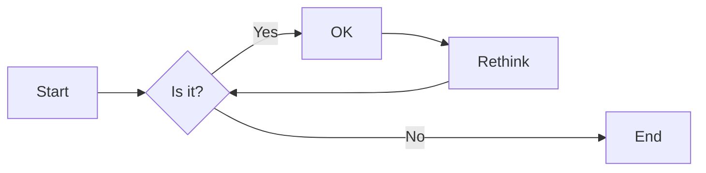
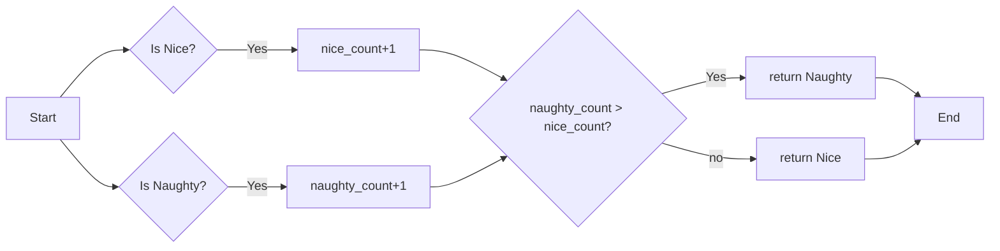
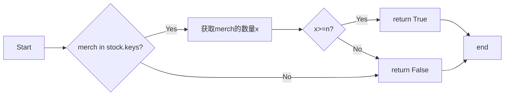

# 实验四 Python字典和while循环

班级： 21计科3班

学号： B20210302312

姓名： 曾靖

Github地址：<https://github.com/flojelr/python-class>

CodeWars地址：<https://www.codewars.com/users/flojelr>

---

## 实验目的

1. 学习Python字典
2. 学习Python用户输入和while循环

## 实验环境

1. Git
2. Python 3.10
3. VSCode
4. VSCode插件

## 实验内容和步骤

### 第一部分

Python列表操作

完成教材《Python编程从入门到实践》下列章节的练习：

- 第6章 字典
- 第7章 用户输入和while循环

---

### 第二部分

在[Codewars网站](https://www.codewars.com)注册账号，完成下列Kata挑战：

---

#### 第一题：淘气还是乖孩子（Naughty or Nice）

难度： 7kyu

圣诞老人要来镇上了，他需要你帮助找出谁是淘气的或善良的。你将会得到一整年的JSON数据，按照这个格式：

```python
{
    January: {
        '1': 'Naughty','2': 'Naughty', ..., '31': 'Nice'
    },
    February: {
        '1': 'Nice','2': 'Naughty', ..., '28': 'Nice'
    },
    ...
    December: {
        '1': 'Nice','2': 'Nice', ..., '31': 'Naughty'
    }
}
```

你的函数应该返回 "Naughty!"或 "Nice!"，这取决于在某一年发生的总次数（以较大者为准）。如果两者相等，则返回 "Nice！"。
代码提交地址：
<https://www.codewars.com/kata/5662b14e0a1fb8320a00005c>

---

#### 第二题： 观察到的PIN（The observed PIN）

难度：4kyu

好了，侦探，我们的一个同事成功地观察到了我们的目标人物，抢劫犯罗比。我们跟踪他到了一个秘密仓库，我们认为在那里可以找到所有被盗的东西。这个仓库的门被一个电子密码锁所保护。不幸的是，我们的间谍不确定他看到的密码，当罗比进入它时。

键盘的布局如下：

```python
┌───┬───┬───┐
│ 1 │ 2 │ 3 │
├───┼───┼───┤
│ 4 │ 5 │ 6 │
├───┼───┼───┤
│ 7 │ 8 │ 9 │
└───┼───┼───┘
    │ 0 │
    └───┘
```

他注意到密码1357，但他也说，他看到的每个数字都有可能是另一个相邻的数字（水平或垂直，但不是对角线）。例如，代替1的也可能是2或4。而不是5，也可能是2、4、6或8。

他还提到，他知道这种锁。你可以无限制地输入错误的密码，但它们最终不会锁定系统或发出警报。这就是为什么我们可以尝试所有可能的（*）变化。

*可能的意义是：观察到的PIN码本身和考虑到相邻数字的所有变化。

你能帮助我们找到所有这些变化吗？如果有一个函数，能够返回一个列表，其中包含一个长度为1到8位的观察到的PIN的所有变化，那就更好了。我们可以把这个函数命名为getPINs（在python中为get_pins，在C#中为GetPINs）。

但请注意，所有的PINs，包括观察到的PINs和结果，都必须是字符串，因为有可能会有领先的 "0"。我们已经为你准备了一些测试案例。
侦探，我们就靠你了!
代码提交地址：
<https://www.codewars.com/kata/5263c6999e0f40dee200059d>

---

#### 第三题： RNA到蛋白质序列的翻译（RNA to Protein Sequence Translation）

难度：6kyu

蛋白质是由DNA转录成RNA，然后转译成蛋白质的中心法则。RNA和DNA一样，是由糖骨架（在这种情况下是核糖）连接在一起的长链核酸。每个由三个碱基组成的片段被称为密码子。称为核糖体的分子机器将RNA密码子转译成氨基酸链，称为多肽链，然后将其折叠成蛋白质。

蛋白质序列可以像DNA和RNA一样很容易地可视化，作为大字符串。重要的是要注意，“停止”密码子不编码特定的氨基酸。它们的唯一功能是停止蛋白质的转译，因此它们不会被纳入多肽链中。“停止”密码子不应出现在最终的蛋白质序列中。为了节省您许多不必要（和乏味）的键入，已为您的氨基酸字典提供了键和值。

给定一个RNA字符串，创建一个将RNA转译为蛋白质序列的函数。注意：测试用例将始终生成有效的字符串。

```python
protein（'UGCGAUGAAUGGGCUCGCUCC'）
```

将返回`CDEWARS`

作为测试用例的一部分是一个真实世界的例子！最后一个示例测试用例对应着一种叫做绿色荧光蛋白的蛋白质，一旦被剪切到另一个生物体的基因组中，像GFP这样的蛋白质可以让生物学家可视化细胞过程！

Amino Acid Dictionary

```python
   # Your dictionary is provided as PROTEIN_DICT
   PROTEIN_DICT = {
    # Phenylalanine
    'UUC': 'F', 'UUU': 'F',
    # Leucine
    'UUA': 'L', 'UUG': 'L', 'CUU': 'L', 'CUC': 'L', 'CUA': 'L', 'CUG': 'L',
    # Isoleucine
    'AUU': 'I', 'AUC': 'I', 'AUA': 'I',
    # Methionine
    'AUG': 'M',
    # Valine
    'GUU': 'V', 'GUC': 'V', 'GUA': 'V', 'GUG': 'V',
    # Serine
    'UCU': 'S', 'UCC': 'S', 'UCA': 'S', 'UCG': 'S', 'AGU': 'S', 'AGC': 'S',
    # Proline
    'CCU': 'P', 'CCC': 'P', 'CCA': 'P', 'CCG': 'P',
    # Threonine
    'ACU': 'T', 'ACC': 'T', 'ACA': 'T', 'ACG': 'T',
    # Alanine
    'GCU': 'A', 'GCC': 'A', 'GCA': 'A', 'GCG': 'A',
    # Tyrosine
    'UAU': 'Y', 'UAC': 'Y',
    # Histidine
    'CAU': 'H', 'CAC': 'H',
    # Glutamine
    'CAA': 'Q', 'CAG': 'Q',
    # Asparagine
    'AAU': 'N', 'AAC': 'N',
    # Lysine
    'AAA': 'K', 'AAG': 'K',
    # Aspartic Acid
    'GAU': 'D', 'GAC': 'D',
    # Glutamic Acid
    'GAA': 'E', 'GAG': 'E',
    # Cystine
    'UGU': 'C', 'UGC': 'C',
    # Tryptophan
    'UGG': 'W',
    # Arginine
    'CGU': 'R', 'CGC': 'R', 'CGA': 'R', 'CGG': 'R', 'AGA': 'R', 'AGG': 'R',
    # Glycine
    'GGU': 'G', 'GGC': 'G', 'GGA': 'G', 'GGG': 'G',
    # Stop codon
    'UAA': 'Stop', 'UGA': 'Stop', 'UAG': 'Stop'
}
```

代码提交地址：
<https://www.codewars.com/kata/555a03f259e2d1788c000077>

---

#### 第四题： 填写订单（Thinkful - Dictionary drills: Order filler）

难度：8kyu

您正在经营一家在线业务，您的一天中很大一部分时间都在处理订单。随着您的销量增加，这项工作占用了更多的时间，不幸的是最近您遇到了一个情况，您接受了一个订单，但无法履行。

您决定写一个名为`fillable()`的函数，它接受三个参数：一个表示您库存的字典`stock`，一个表示客户想要购买的商品的字符串`merch`，以及一个表示他们想购买的商品数量的整数n。如果您有足够的商品库存来完成销售，则函数应返回`True`，否则应返回`False`。

有效的数据将始终被传入，并且n将始终大于等于1。

代码提交地址：
<https://www.codewars.com/kata/586ee462d0982081bf001f07/python>

---

#### 第五题： 莫尔斯码解码器（Decode the Morse code, advanced）

难度： 4kyu

在这个作业中，你需要为有线电报编写一个莫尔斯码解码器。
有线电报通过一个有按键的双线路运行，当按下按键时，会连接线路，可以在远程站点上检测到。莫尔斯码将每个字符的传输编码为"点"（按下按键的短按）和"划"（按下按键的长按）的序列。

在传输莫尔斯码时，国际标准规定：

- "点" - 1个时间单位长。
- "划" - 3个时间单位长。
- 字符内点和划之间的暂停 - 1个时间单位长。
- 单词内字符之间的暂停 - 3个时间单位长。
- 单词间的暂停 - 7个时间单位长。

但是，该标准没有规定"时间单位"有多长。实际上，不同的操作员会以不同的速度进行传输。一个业余人士可能需要几秒钟才能传输一个字符，一位熟练的专业人士可以每分钟传输60个单词，而机器人发射器可能会快得多。

在这个作业中，我们假设消息的接收是由硬件自动执行的，硬件会定期检查线路，如果线路连接（远程站点的按键按下），则记录为1，如果线路未连接（远程按键弹起），则记录为0。消息完全接收后，它会以一个只包含0和1的字符串的形式传递给你进行解码。

例如，消息`HEY JUDE`，即`···· · −·−−   ·−−− ··− −·· ·`可以如下接收：

```python
1100110011001100000011000000111111001100111111001111110000000000000011001111110011111100111111000000110011001111110000001111110011001100000011
```

如您所见，根据标准，这个传输完全准确，硬件每个"点"采样了两次。

因此，你的任务是实现两个函数：

函数decodeBits(bits)，应该找出消息的传输速率，正确解码消息为点（.）、划（-）和空格（字符之间有一个空格，单词之间有三个空格），并将它们作为一个字符串返回。请注意，在消息的开头和结尾可能会出现一些额外的0，确保忽略它们。另外，如果你无法分辨特定的1序列是点还是划，请假设它是一个点。

函数decodeMorse(morseCode)，它将接收上一个函数的输出，并返回一个可读的字符串。

注意：出于编码目的，你必须使用ASCII字符.和-，而不是Unicode字符。

莫尔斯码表已经预加载给你了（请查看解决方案设置，以获取在你的语言中使用它的标识符）。

```python
morseCodes(".--")  #to access the morse translation of ".--"
```

下面是Morse码支持的完整字符列表：

```javascript
A    ·–
B    –···
C    –·–·
D    –··
E    ·
F    ··–·
G    ––·
H    ····
I    ··
J    ·–––
K    –·–
L    ·–··
M    ––
N    –·
O    –––
P    ·––·
Q    ––·–
R    ·–·
S    ···
T    –
U    ··–
V    ···–
W    ·––
X    –··–
Y    –·––
Z    ––··
0    –––––
1    ·––––
2    ··–––
3    ···––
4    ····–
5    ·····
6    –····
7    ––···
8    –––··
9    ––––·
.    ·–·–·–
,    ––··––
?    ··––··
'    ·––––·
!    –·–·––
/    –··–·
(    –·––·
)    –·––·–
&    ·–···
:    –––···
;    –·–·–·
=    –···–
+    ·–·–·
-    –····–
_    ··––·–
"    ·–··–·
$    ···–··–
@    ·––·–·
```

代码提交地址：
<https://www.codewars.com/kata/decode-the-morse-code-advanced>

---

### 第三部分

使用Mermaid绘制程序流程图

安装VSCode插件：

- Markdown Preview Mermaid Support
- Mermaid Markdown Syntax Highlighting

使用Markdown语法绘制你的程序绘制程序流程图（至少一个），Markdown代码如下：


显示效果如下：



查看Mermaid流程图语法-->[点击这里](https://mermaid.js.org/syntax/flowchart.html)

使用Markdown编辑器（例如VScode）编写本次实验的实验报告，包括[实验过程与结果](#实验过程与结果)、[实验考查](#实验考查)和[实验总结](#实验总结)，并将其导出为 **PDF格式** 来提交。

## 实验过程与结果

### 第一题：淘气还是乖孩子

圣诞老人要来镇上了，他需要你帮助找出谁是淘气的或善良的。你将会得到一整年的JSON数据，按照这个格式：

```python
{
    January: {
        '1': 'Naughty','2': 'Naughty', ..., '31': 'Nice'
    },
    February: {
        '1': 'Nice','2': 'Naughty', ..., '28': 'Nice'
    },
    ...
    December: {
        '1': 'Nice','2': 'Nice', ..., '31': 'Naughty'
    }
}
```

你的函数应该返回 "Naughty!"或 "Nice!"，这取决于在某一年发生的总次数（以较大者为准）。如果两者相等，则返回 "Nice！"。
代码提交地址：
<https://www.codewars.com/kata/5662b14e0a1fb8320a00005c>

代码如下：

```python
def naughty_or_nice(data):
    nice_count=0
    naughty_count=0
    for key,value in data.items():
#         print ('key: ',key,'value: ',value)
        for key1,value1 in value.items():
#             print (value1)
            if( value1 == "Nice" ):
                nice_count = nice_count + 1
            if(value1 == "Naughty"):
                naughty_count = naughty_count + 1
    if(naughty_count > nice_count ):
        return "Naughty!"
    else : return "Nice!"
```

流程图如下：



---

### 第二题： 观察到的PIN

好了，侦探，我们的一个同事成功地观察到了我们的目标人物，抢劫犯罗比。我们跟踪他到了一个秘密仓库，我们认为在那里可以找到所有被盗的东西。这个仓库的门被一个电子密码锁所保护。不幸的是，我们的间谍不确定他看到的密码，当罗比进入它时。

键盘的布局如下：

```python
┌───┬───┬───┐
│ 1 │ 2 │ 3 │
├───┼───┼───┤
│ 4 │ 5 │ 6 │
├───┼───┼───┤
│ 7 │ 8 │ 9 │
└───┼───┼───┘
    │ 0 │
    └───┘
```

他注意到密码1357，但他也说，他看到的每个数字都有可能是另一个相邻的数字（水平或垂直，但不是对角线）。例如，代替1的也可能是2或4。而不是5，也可能是2、4、6或8。

他还提到，他知道这种锁。你可以无限制地输入错误的密码，但它们最终不会锁定系统或发出警报。这就是为什么我们可以尝试所有可能的（*）变化。

*可能的意义是：观察到的PIN码本身和考虑到相邻数字的所有变化。

你能帮助我们找到所有这些变化吗？如果有一个函数，能够返回一个列表，其中包含一个长度为1到8位的观察到的PIN的所有变化，那就更好了。我们可以把这个函数命名为getPINs（在python中为get_pins，在C#中为GetPINs）。

但请注意，所有的PINs，包括观察到的PINs和结果，都必须是字符串，因为有可能会有领先的 "0"。我们已经为你准备了一些测试案例。
侦探，我们就靠你了!
代码提交地址：
<https://www.codewars.com/kata/5263c6999e0f40dee200059d>

代码如下：

```python
from itertools import product
def get_pins(observed):
    
    x=list(observed)
    lenth=len(observed)
    z=[[]for i in range(lenth)]
    pin_dict={'1':{'1','2','4'},'2':{'1','2','3','5'},'3':{'2','3','6'},'4':{'1','4','5','7'},'5':{'2','4','5','6','8'},'6':{'3','5','6','9'},'7':{'4','7','8'},'8':{'5','7','8','9','0'},'9':{'6','8','9'},'0':{'8','0'}}
    for i in range(0,lenth):
        z[i]=pin_dict[x[i]]
        z[i]=list(z[i])
    a=list(product(*z))
    n=len(a)
    for i in range(0,n):
        a[i]=" ".join(a[i])
        a[i]=a[i].replace(' ','')
    return a
    pass # TODO: This is your job, detective!

```

---

### 第三题： RNA到蛋白质序列的翻译

蛋白质是由DNA转录成RNA，然后转译成蛋白质的中心法则。RNA和DNA一样，是由糖骨架（在这种情况下是核糖）连接在一起的长链核酸。每个由三个碱基组成的片段被称为密码子。称为核糖体的分子机器将RNA密码子转译成氨基酸链，称为多肽链，然后将其折叠成蛋白质。

蛋白质序列可以像DNA和RNA一样很容易地可视化，作为大字符串。重要的是要注意，“停止”密码子不编码特定的氨基酸。它们的唯一功能是停止蛋白质的转译，因此它们不会被纳入多肽链中。“停止”密码子不应出现在最终的蛋白质序列中。为了节省您许多不必要（和乏味）的键入，已为您的氨基酸字典提供了键和值。

给定一个RNA字符串，创建一个将RNA转译为蛋白质序列的函数。注意：测试用例将始终生成有效的字符串。

代码提交地址：
<https://www.codewars.com/kata/555a03f259e2d1788c000077>

代码如下：

```python
def protein(rna):
    PROTEIN_DICT = {
    # Phenylalanine
    'UUC': 'F', 'UUU': 'F',
    # Leucine
    'UUA': 'L', 'UUG': 'L', 'CUU': 'L', 'CUC': 'L', 'CUA': 'L', 'CUG': 'L',
    # Isoleucine
    'AUU': 'I', 'AUC': 'I', 'AUA': 'I',
    # Methionine
    'AUG': 'M',
    # Valine
    'GUU': 'V', 'GUC': 'V', 'GUA': 'V', 'GUG': 'V',
    # Serine
    'UCU': 'S', 'UCC': 'S', 'UCA': 'S', 'UCG': 'S', 'AGU': 'S', 'AGC': 'S',
    # Proline
    'CCU': 'P', 'CCC': 'P', 'CCA': 'P', 'CCG': 'P',
    # Threonine
    'ACU': 'T', 'ACC': 'T', 'ACA': 'T', 'ACG': 'T',
    # Alanine
    'GCU': 'A', 'GCC': 'A', 'GCA': 'A', 'GCG': 'A',
    # Tyrosine
    'UAU': 'Y', 'UAC': 'Y',
    # Histidine
    'CAU': 'H', 'CAC': 'H',
    # Glutamine
    'CAA': 'Q', 'CAG': 'Q',
    # Asparagine
    'AAU': 'N', 'AAC': 'N',
    # Lysine
    'AAA': 'K', 'AAG': 'K',
    # Aspartic Acid
    'GAU': 'D', 'GAC': 'D',
    # Glutamic Acid
    'GAA': 'E', 'GAG': 'E',
    # Cystine
    'UGU': 'C', 'UGC': 'C',
    # Tryptophan
    'UGG': 'W',
    # Arginine
    'CGU': 'R', 'CGC': 'R', 'CGA': 'R', 'CGG': 'R', 'AGA': 'R', 'AGG': 'R',
    # Glycine
    'GGU': 'G', 'GGC': 'G', 'GGA': 'G', 'GGG': 'G',
    # Stop codon
    'UAA': 'Stop', 'UGA': 'Stop', 'UAG': 'Stop'
}
    n=len(rna)
    str=[[]for i in range(int(n/3))]
    end=[]
    for i in range(0,int(n/3)):
        str[i].append(rna[i*3])
        str[i].append(rna[i*3+1])
        str[i].append(rna[i*3+2])
        str[i]="".join(str[i])
        if str[i]!='UAA' and str[i]!='UGA' and str[i]!='UAG':
            end.append(PROTEIN_DICT[str[i]])
        else: break
    end=''.join(end)
    return end
    # your code here
```

---

### 第四题： 填写订单

您正在经营一家在线业务，您的一天中很大一部分时间都在处理订单。随着您的销量增加，这项工作占用了更多的时间，不幸的是最近您遇到了一个情况，您接受了一个订单，但无法履行。

您决定写一个名为`fillable()`的函数，它接受三个参数：一个表示您库存的字典`stock`，一个表示客户想要购买的商品的字符串`merch`，以及一个表示他们想购买的商品数量的整数n。如果您有足够的商品库存来完成销售，则函数应返回`True`，否则应返回`False`。

有效的数据将始终被传入，并且n将始终大于等于1。

代码提交地址：
<https://www.codewars.com/kata/586ee462d0982081bf001f07/python>

代码如下：

```python
def fillable(stock, merch, n):
    if merch in stock.keys():
        x=stock[merch]
        if x>=n:
            return True
        
    return False
```



---

### 第五题： 莫尔斯码解码器

在这个作业中，你需要为有线电报编写一个莫尔斯码解码器。
有线电报通过一个有按键的双线路运行，当按下按键时，会连接线路，可以在远程站点上检测到。莫尔斯码将每个字符的传输编码为"点"（按下按键的短按）和"划"（按下按键的长按）的序列。

代码提交地址：
<https://www.codewars.com/kata/decode-the-morse-code-advanced>

代码如下：

```python
def decode_bits(bits):
    # ToDo: Accept 0's and 1's, return dots, dashes and spaces
    bits=bits.strip('0')
    
    if '0' not in bits:
        return '.'
    
    minOnes = min(len(s) for s in bits.split('0') if s)
    minZeros = min(len(s) for s in bits.split('1') if s)
    m = min(minOnes, minZeros)
    
    return bits.replace('111'*m, '-').replace('000'*m, ' ').replace('1'*m, '.').replace('0'*m, '')

def decode_morse(morseCode):
    # ToDo: Accept dots, dashes and spaces, return human-readable message
    print(morseCode)
    x=[]
    z=[]
    j=0
    while(j < len(morseCode)):
        if(morseCode[j]!=' '):
            x.append(morseCode[j])
        else:
            if(len(x)!=0):
                end=''.join(x)
                x.clear()
                z.append(MORSE_CODE[end])
            else:
                z.append(' ')                
        j+=1
        
    if(len(x)!=0):
        end=''.join(x)
        x.clear()
        z.append(MORSE_CODE[end])

    return ''.join(z)
```

## 实验考查

请使用自己的语言并使用尽量简短代码示例回答下面的问题，这些问题将在实验检查时用于提问和答辩以及实际的操作。

1. 字典的键和值有什么区别？

   答：键可以是数字、字符串、元组。 就像英汉词典一样，可以通过查找某个特定的词语（键），从而找到它的定义（值）。 键必须是唯一的，但值则不必。 值可以取任何数据类型，但键必须是不可变的，如字符串，数字或元组。

2. 在读取和写入字典时，需要使用默认值可以使用什么方法？

    答：可使用.setdefault (key,value)方法

3. Python中的while循环和for循环有什么区别？

    答：for 适用于已知循环次数的循环 while 适用于未知循环次数的循环；for 通常用于遍历可迭代对象 while 很少进行遍历使用；for 循环是在序列穷尽时停止， while 循环是在条件不成立时停止。

4. 阅读[PEP 636 – Structural Pattern Matching: Tutorial](https://peps.python.org/pep-0636/), 总结Python 3.10中新出现的match语句的使用方法。

    答：match语句是一种用于结构模式匹配的强大工具，使用结构大致为

    ```python
    match expression:  
    case pattern1:  
        # 对应的代码块  
    case pattern2:  
        # 对应的代码块  
    ...  
    case patternN:  
        # 对应的代码块  
        # 如果没有匹配的模式，可以添加一个默认的case  
    case _:  
        # 默认的代码块
    ```

    其中expression是需要进行模式匹配的表达式，pattern1，pattern2 …… patternN 则是用于匹配的模式，当他们匹配成功后，才会进行对应去的代码块。

## 实验总结

通过本次实验，我更加深入了解了字典的使用，学会了字典遍历与取值。同时我也知道了while循环与for循环之间的不同之处。
