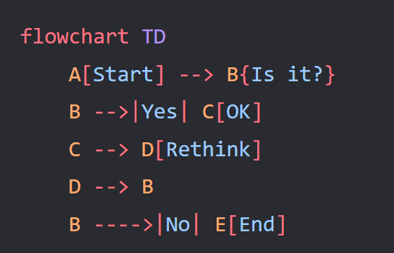
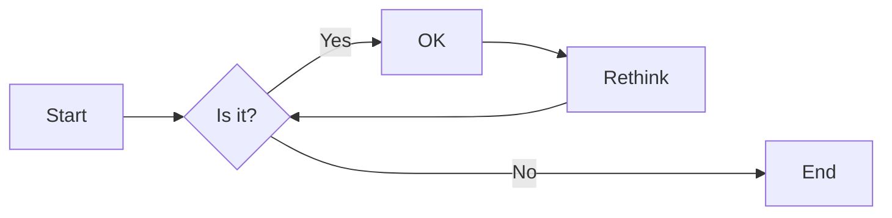
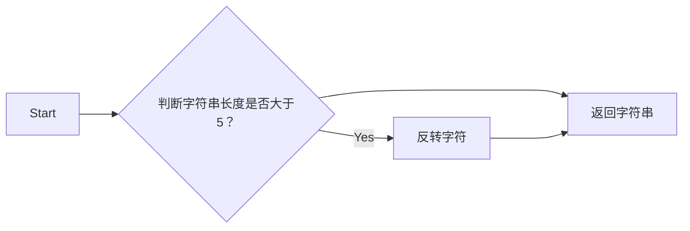
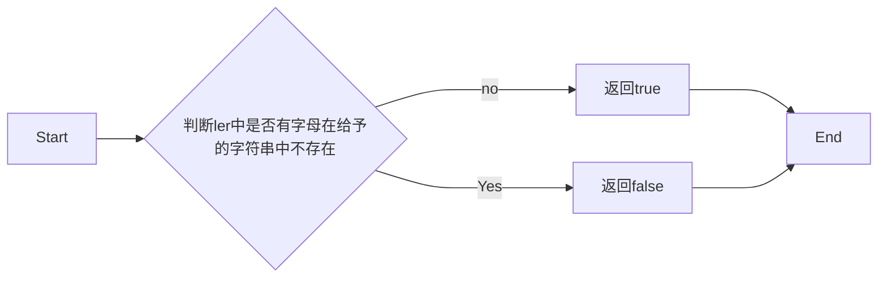

# 实验五 Python数据结构与数据模型

班级： 21计科3班

学号： B20210302312

姓名： 曾靖

Github地址：<https://github.com/flojelr/python-class>

CodeWars地址：<https://www.codewars.com/users/flojelr>

---

## 实验目的

1. 学习Python数据结构的高级用法
2. 学习Python的数据模型

## 实验环境

1. Git
2. Python 3.10
3. VSCode
4. VSCode插件

## 实验内容和步骤

### 第一部分

在[Codewars网站](https://www.codewars.com)注册账号，完成下列Kata挑战：

---

#### 第一题：停止逆转我的单词

难度： 6kyu

编写一个函数，接收一个或多个单词的字符串，并返回相同的字符串，但所有5个或更多的字母单词都是相反的（就像这个Kata的名字一样）。传入的字符串将只由字母和空格组成。只有当出现一个以上的单词时，才会包括空格。
例如：

```python
spinWords( "Hey fellow warriors" ) => returns "Hey wollef sroirraw" 
spinWords( "This is a test") => returns "This is a test" 
spinWords( "This is another test" )=> returns "This is rehtona test"
```

代码提交地址：
<https://www.codewars.com/kata/5264d2b162488dc400000001>

提示：

- 利用str的split方法可以将字符串分为单词列表
例如：

```python
words = "hey fellow warrior".split()
# words should be ['hey', 'fellow', 'warrior']
```

- 利用列表推导将长度大于等于5的单词反转(利用切片word[::-1])
- 最后使用str的join方法连结列表中的单词。

---

#### 第二题： 发现离群的数(Find The Parity Outlier)

难度：6kyu

给你一个包含整数的数组（其长度至少为3，但可能非常大）。该数组要么完全由奇数组成，要么完全由偶数组成，除了一个整数N。请写一个方法，以该数组为参数，返回这个 "离群 "的N。

例如：

```python
[2, 4, 0, 100, 4, 11, 2602, 36]
# Should return: 11 (the only odd number)

[160, 3, 1719, 19, 11, 13, -21]
# Should return: 160 (the only even number)
```

代码提交地址：
<https://www.codewars.com/kata/5526fc09a1bbd946250002dc>

---

#### 第三题： 检测Pangram

难度：6kyu

pangram是一个至少包含每个字母一次的句子。例如，"The quick brown fox jumps over the lazy dog "这个句子就是一个pangram，因为它至少使用了一次字母A-Z（大小写不相关）。

给定一个字符串，检测它是否是一个pangram。如果是则返回`True`，如果不是则返回`False`。忽略数字和标点符号。
代码提交地址：
<https://www.codewars.com/kata/545cedaa9943f7fe7b000048>

---

#### 第四题： 数独解决方案验证

难度：6kyu

数独背景

数独是一种在 9x9 网格上进行的游戏。游戏的目标是用 1 到 9 的数字填充网格的所有单元格，以便每一列、每一行和九个 3x3 子网格（也称为块）中的都包含数字 1 到 9。更多信息请访问：<http://en.wikipedia.org/wiki/Sudoku>

编写一个函数接受一个代表数独板的二维数组，如果它是一个有效的解决方案则返回 true，否则返回 false。数独板的单元格也可能包含 0，这将代表空单元格。包含一个或多个零的棋盘被认为是无效的解决方案。棋盘总是 9 x 9 格，每个格只包含 0 到 9 之间的整数。

代码提交地址：
<https://www.codewars.com/kata/63d1bac72de941033dbf87ae>

---

#### 第五题： 疯狂的彩色三角形

难度： 2kyu

一个彩色的三角形是由一排颜色组成的，每一排都是红色、绿色或蓝色。连续的几行，每一行都比上一行少一种颜色，是通过考虑前一行中的两个相接触的颜色而产生的。如果这些颜色是相同的，那么新的一行就使用相同的颜色。如果它们不同，则在新的一行中使用缺失的颜色。这个过程一直持续到最后一行，只有一种颜色被生成。

例如：

```python
    Colour here:            G G        B G        R G        B R
    Becomes colour here:     G          R          B          G
```

一个更大的三角形例子：

```python
R R G B R G B B
 R B R G B R B
  G G B R G G
   G R G B G
    B B R R
     B G R
      R B
       G
```

你将得到三角形的第一行字符串，你的工作是返回最后的颜色，这将出现在最下面一行的字符串。在上面的例子中，你将得到 "RRGBRGBB"，你应该返回 "G"。
限制条件： 1 <= length(row) <= 10 ** 5
输入的字符串将只包含大写字母'B'、'G'或'R'。

例如：

```python
triangle('B') == 'B'
triangle('GB') == 'R'
triangle('RRR') == 'R'
triangle('RGBG') == 'B'
triangle('RBRGBRB') == 'G'
triangle('RBRGBRBGGRRRBGBBBGG') == 'G'
```

代码提交地址：
<https://www.codewars.com/kata/5a331ea7ee1aae8f24000175>

提示：请参考下面的链接，利用三进制的特点来进行计算。
<https://stackoverflow.com/questions/53585022/three-colors-triangles>

---

### 第二部分

使用Mermaid绘制程序流程图

安装VSCode插件：

- Markdown Preview Mermaid Support
- Mermaid Markdown Syntax Highlighting

使用Markdown语法绘制你的程序绘制程序流程图（至少一个），Markdown代码如下：



显示效果如下：



查看Mermaid流程图语法-->[点击这里](https://mermaid.js.org/syntax/flowchart.html)

使用Markdown编辑器（例如VScode）编写本次实验的实验报告，包括[实验过程与结果](#实验过程与结果)、[实验考查](#实验考查)和[实验总结](#实验总结)，并将其导出为 **PDF格式** 来提交。

## 实验过程与结果

### 第一题

编写一个函数，接收一个或多个单词的字符串，并返回相同的字符串，但所有5个或更多的字母单词都是相反的（就像这个Kata的名字一样）。传入的字符串将只由字母和空格组成。只有当出现一个以上的单词时，才会包括空格。
例如：

```python
spinWords( "Hey fellow warriors" ) => returns "Hey wollef sroirraw" 
spinWords( "This is a test") => returns "This is a test" 
spinWords( "This is another test" )=> returns "This is rehtona test"
```

实验代码：

```python
def spin_words(sentence):
    print(sentence.split())
    x=sentence.split()
    lenth=len(x)
    for i in range(0,lenth):
        if len(x[i])>=5:
            y=list(x[i])
            y.reverse()
            x[i]=''.join(y)

    x=' '.join(x)
    return x
```



---

### 第二题

给你一个包含整数的数组（其长度至少为3，但可能非常大）。该数组要么完全由奇数组成，要么完全由偶数组成，除了一个整数N。请写一个方法，以该数组为参数，返回这个 "离群 "的N。

例如：

```python
[2, 4, 0, 100, 4, 11, 2602, 36]
# Should return: 11 (the only odd number)

[160, 3, 1719, 19, 11, 13, -21]
# Should return: 160 (the only even number)
```

实验代码：

```python
def find_outlier(integers):
    odd_count=[0,0]
    even_count=[0,0]
    for i in range(0,len(integers)):
        if(integers[i]%2==0):
            even_count[0]+=1
            even_count[1]=i
        else :
            odd_count[0]+=1
            odd_count[1]=i
    if(even_count[0]==1):
        return integers[even_count[1]]
    if(odd_count[0]==1):
        return integers[odd_count[1]]
    return None
```

---

### 第三题

pangram是一个至少包含每个字母一次的句子。例如，"The quick brown fox jumps over the lazy dog "这个句子就是一个pangram，因为它至少使用了一次字母A-Z（大小写不相关）。

给定一个字符串，检测它是否是一个pangram。如果是则返回`True`，如果不是则返回`False`。忽略数字和标点符号。

实验代码：

```python
def is_pangram(s):
    ler=['a','b','c','d','e','f','g','h','i','j','k','l','m','n','o','p','q','r','s','t','u','v','w','x','y','z']
    count=0
    if len(s)>=26:
        s=s.lower()
        i=0
        while(i<len(ler)):
            if(ler[i] in s):
                count+=1
            i+=1
        if(count==26):
            return True
    
    return False
```



---

### 第四题

数独背景

数独是一种在 9x9 网格上进行的游戏。游戏的目标是用 1 到 9 的数字填充网格的所有单元格，以便每一列、每一行和九个 3x3 子网格（也称为块）中的都包含数字 1 到 9。更多信息请访问：<http://en.wikipedia.org/wiki/Sudoku>

编写一个函数接受一个代表数独板的二维数组，如果它是一个有效的解决方案则返回 true，否则返回 false。数独板的单元格也可能包含 0，这将代表空单元格。包含一个或多个零的棋盘被认为是无效的解决方案。棋盘总是 9 x 9 格，每个格只包含 0 到 9 之间的整数。

实验代码：

```python
def validate_sudoku(board):
    num=[1,2,3,4,5,6,7,8,9]
    L_board = list(map(list, zip(*board)))
    s_board=[[] for i in range(9)]
    for i in range(0,9):
        if(i/3==0):
            z=0
        if (i/3==1):
            z=3
        if(i/3==2):
            z=6
        for j in range(0,9):
            if(j/3==0):
                s=0
            if (j/3==1):
                s=1
            if(j/3==2):
                s=2
            s_board[z+s].append(board[i][j])
            
    for i in range(0,len(board)):
        for j in range(0,len(num)):
            if (num[j] not in board[i]):
                return False
            if (num[j] not in L_board[i]):
                return False
            if (num[j] not in s_board[i]):
                return False
        
    return True
```

---

### 第五题

难度： 2kyu

一个彩色的三角形是由一排颜色组成的，每一排都是红色、绿色或蓝色。连续的几行，每一行都比上一行少一种颜色，是通过考虑前一行中的两个相接触的颜色而产生的。如果这些颜色是相同的，那么新的一行就使用相同的颜色。如果它们不同，则在新的一行中使用缺失的颜色。这个过程一直持续到最后一行，只有一种颜色被生成。

例如：

```python
    Colour here:            G G        B G        R G        B R
    Becomes colour here:     G          R          B          G
```

一个更大的三角形例子：

```python
R R G B R G B B
 R B R G B R B
  G G B R G G
   G R G B G
    B B R R
     B G R
      R B
       G
```

你将得到三角形的第一行字符串，你的工作是返回最后的颜色，这将出现在最下面一行的字符串。在上面的例子中，你将得到 "RRGBRGBB"，你应该返回 "G"。
限制条件： 1 <= length(row) <= 10 ** 5
输入的字符串将只包含大写字母'B'、'G'或'R'。

例如：

```python
triangle('B') == 'B'
triangle('GB') == 'R'
triangle('RRR') == 'R'
triangle('RGBG') == 'B'
triangle('RBRGBRB') == 'G'
triangle('RBRGBRBGGRRRBGBBBGG') == 'G'
```

实验代码：

```python
def triangle(row):
    
    reduce=[3**i+1 for i in range(10) if 3**i<=100000][::-1]
    
    COLOR = {'GG':'G', 'BB':'B', 'RR':'R', 'BR':'G', 
            'BG':'R', 'GB':'R', 'GR':'B', 'RG':'B', 'RB':'G'}
    
    for length in reduce:
        while len(row)>=length:
            row=[ COLOR[row[i] + row[i+length-1]] for i in range(len(row)-length+1)]
    return row[0]
```

**注意：不要使用截图，因为Markdown文档转换为Pdf格式后，截图会无法显示。**

## 实验考查

请使用自己的语言并使用尽量简短代码示例回答下面的问题，这些问题将在实验检查时用于提问和答辩以及实际的操作。

1. 集合（set）类型有什么特点？它和列表（list）类型有什么区别？

    答：集合的特点：集合中的元素是唯一的，没有重复；集合是无序的；集合不支持索引；集合可以进行交集、并集、差集等操作。与列表（list）类型相比，集合有以下区别：列表是有序的，而集合是无序的；列表可以包含重复的元素，而集合中的元素必须是唯一的；列表支持索引，而集合不支持；集合可以进行交集、并集、差集等操作，而列表则没有这些操作。

2. 集合（set）类型主要有那些操作？

   答：集合主要有交集、并集、差集等操作。

3. 使用`*`操作符作用到列表上会产生什么效果？为什么不能使用`*`操作符作用到嵌套的列表上？使用简单的代码示例说明。

    答：`*`操作符在Python中对列表的操作取决于上下文，它可以用于重复列表、解包列表或者在生成器表达式中用于"星化"输入的元素。当我们尝试对嵌套的列表使用*操作符时，会出现一些问题。这主要是因为*操作符的行为取决于其操作的对象。当它应用于一个列表时，它可以用于重复该列表或者解包该列表的内容。然而，当它应用于一个嵌套的列表时，Python不知道你想要重复整个嵌套列表还是解包它的内容，或者对每个子列表进行重复或解包。因此，这会引发歧义，从而导致错误。

    ```python
    nested_list = [[1, 2, 3], [4, 5, 6], [7, 8, 9]]  
    
    # 试图使用 * 操作符来解包 nested_list 会引发 TypeError  
    print(*nested_list)  # 报错：TypeError: 'list' object is not callable  
    
    # 试图使用 * 操作符来重复整个 nested_list 会引发 TypeError  
    nested_list_repeated = nested_list * 2  # 报错：TypeError: 'list' object is not callable
    ```

4. 总结列表,集合，字典的解析（comprehension）的使用方法。使用简单的代码示例说明。

    答：列表解析是创建新列表的一种简洁方式。它在一行中写出创建一个列表的语句，以表达式在每行后面跟随一个for语句的方式。语法为：[expression for item in list]

    ```python
    #使用列表解析来创建一个包含1到100所有偶数的列表
    even_numbers = [x for x in range(101) if x % 2 == 0]  
    print(even_numbers)
    ```

    集合解析与列表解析非常相似，不同之处在于结果是一个集合（set），而不是列表。

    ```python
    #使用集合解析来创建一个包含1到100所有奇数的集合.语法为：{expression for item in list}
    odd_numbers = {x for x in range(1, 101, 2)}  
    print(odd_numbers)
    ```

    字典解析可以创建字典。语法为：{key: expression for item in list}

    ```python
    #使用字典解析来创建一个字典，其中键是1到100的数字，值是该数字的平方：
    squares = {x: x**2 for x in range(1, 101)}  
    print(squares)
    ```

## 实验总结

通过本次实验，我了解了集合与列表之间的区别，以及集合的使用方法。进一步的强化了对字典的使用。